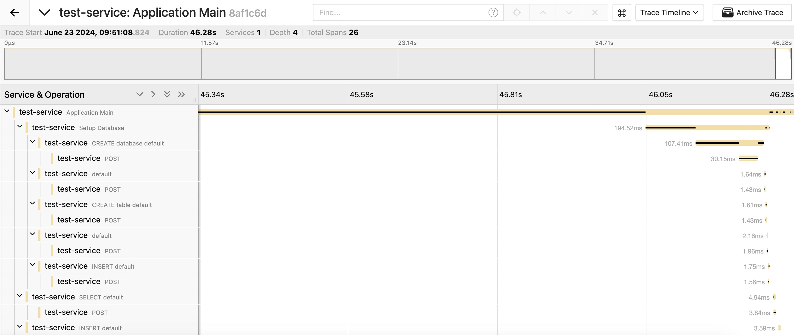

# Clickhouse playground

Uses Java 17

Docker compose will spin up clickhouse server, otel collector, and jaeger.

`./run.sh` will build the jar, run the app with javaagent attached, and generate spans which can be viewed in jaeger.

Access Jaeger UI:
http://localhost:16686

